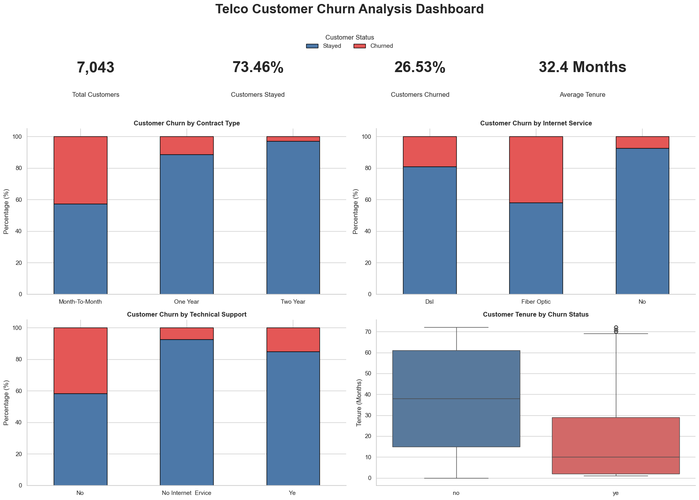

# 📊 Customer Churn Analysis Project

## 📌 Project Overview

Customer retention is a major challenge for subscription-based businesses. This project analyzes customer data to identify **why customers are leaving** and uncover the key factors contributing to churn.

The goal of this analysis is to transform raw customer data into **actionable business insights** that can help companies improve retention strategies and reduce customer loss.

---

# 🎯 Business Question

> **What factors contribute to customer churn, and which customers are most likely to leave?**

---

# 🛠️ Tools & Technologies

| Tool | Purpose |
|---|---|
| 🐍 Python | Data cleaning, analysis, and visualization |
| 🐼 Pandas | Data manipulation and exploration |
| 🔢 NumPy | Numerical analysis |
| 📊 Matplotlib | Data visualization |
| 📈 Seaborn | Statistical visualization |
| 📒 Jupyter Notebook | Analysis environment |

---

# 📂 Dataset

The dataset contains customer information from a telecommunications company.

### Key Features:

👤 **Customer Information**
- Gender
- Senior Citizen status
- Partner
- Dependents

📅 **Customer Relationship**
- Tenure
- Contract type

💳 **Billing Information**
- Monthly Charges
- Total Charges
- Payment Method

🌐 **Services**
- Internet Service
- Online Security
- Technical Support
- Streaming Services

🎯 **Target Variable**
- Churn (Yes / No)

---

# 🔍 Project Workflow

## 1️⃣ Data Cleaning

Performed data quality checks including:

✅ Handling missing values  
✅ Converting data types  
✅ Removing inconsistent formatting  
✅ Standardizing categorical values  
✅ Preparing data for analysis  

---

## 2️⃣ Exploratory Data Analysis (EDA)

Analyzed customer behavior through:

📊 Churn distribution analysis  
📊 Customer demographic analysis  
📊 Contract comparison  
📊 Service usage patterns  
📊 Correlation analysis  

---

# 📈 Key Insights

### 🔹 Customer Tenure

Customers who churn have significantly shorter relationships with the company.

➡️ **New customers are at higher risk of leaving.**

---

### 🔹 Contract Type

Month-to-month customers show the highest churn rate compared to customers with longer contracts.

➡️ **Long-term contracts improve customer retention.**

---

### 🔹 Internet Service

Customers using Fiber Optic services experience higher churn.

➡️ **Service quality and customer experience may require investigation.**

---

### 🔹 Support Services

Customers without technical support are more likely to churn.

➡️ **Customer assistance plays an important role in retention.**

---

# 💡 Business Recommendations

✅ Improve onboarding experience for new customers  
✅ Encourage customers to move from month-to-month contracts to longer plans  
✅ Investigate Fiber Optic service satisfaction issues  
✅ Increase adoption of technical support services  
✅ Create targeted retention campaigns for high-risk customers  

---

# 📊 Dashboard Preview

---

# 🚀 Conclusion

This analysis shows that customer churn is mainly driven by **short customer tenure, flexible month-to-month contracts, higher monthly charges, and lack of support services**.

By identifying high-risk customers early and improving customer experience, businesses can develop strategies to increase retention and customer lifetime value.

